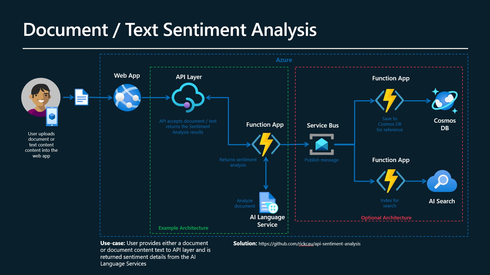

# Sentiment Analysis API - HTTP Trigger

In this example, I leverage an Isolated Azure Function HTTP Trigger to expose an API that allows a user to pass in document text then I use the Semantic Kernel to load a custom Plugin that uses Azure Language Services to analyze the Sentiment of the content and it returns the Sentiment Analysis as a Response Body.

## Technologies

1. Isolated Azure Functions with a HTTP Trigger
2. Azure BlobServiceClient for writing to containers
3. Semantic Kernel and Custom Sentiment Analysis Plugin
1. Dependency Injection for the Semantic Kernel and TextAnalyticsClient
4. Semantic Kernel SKPrompts and Plugins 
4. StreamReader and Regex for file parsing
5. Environment.GetEnvironmentVariable to read settings from **local.settings.json** and Azure Configuration Settings

## Sentiment Analysis API - Http Trigger

This HTTP trigger expose an HTTP Post request with a request body that has the following structure and similar content.

    ~~~
         {
            "Content": "I had the best day of my life. I decided to go sky-diving and it made me appreciate my whole life so much more. I developed a deep-connection with my instructor as well, and I feel as if I've made a life-long friend in her."
         }
    ~~~

## Requirements for this example

1. Create an Azure Language Services Endpoint in Azure
 
2. Rename the **local.settings.json.bak** file to **local.settings.json**, then  set the following values in **local.settings.json** file

   ~~~
    "ApiLanguageKey": "<Your Azure AI Language Service ApiKey",
    "ApiLanguageEndpoint": "<Your Azure AI Language Service Endpoint>"
   ~~~

3. The Data folder you will find an example of the JSON that needs to be passed in the request body of the HTTP Post request.

## How to use this example?
1. You can clone the repo and run it locally using Visual Studio.

2. Open the solution and press F5 to run it locally.

3. Use a tool like Postman or Curl to send an HTTP Post request with the request body containing the JSON structure outlined above.

4. You will get a response back in the response body that contains the sentiment details for the content you passed in.

## How can this be leveraged?
- You leverage this API in conjunction with a WebApp, Canvas App or any client that can send an HTTP POST request for Sentiment Analysis.

## Additional features that can be added to the solution

1. Add support to read files from Blob Storage and return Sentiment Analysis for those files.

2. Add the ability to read a list for files and conduct Sentiment Analysis for all those files.

3. Add the ability to store Sentiment Analysis History to some sort of backing store e.g. CosmosDB

# Architecture

Below is an overview of the Architecture that could be leveraged with the Sentiment Analysis API.

 

